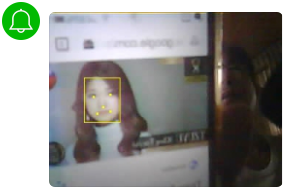
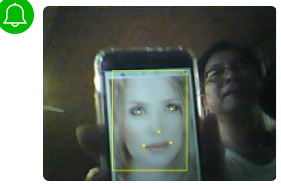
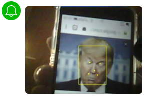
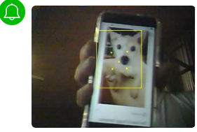
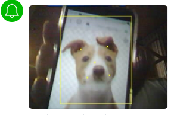

# ESP32CAM-FaceDetect-Line-Notify  
Notify on Line when camera detects a faces!
 
  
Example from ESP-face, ESPinoCam! 
Hardware ESP32Cam from AI-Thinker/ArduCam-IOTai.
  
 
   
   
 
 
  

## References
  - [ESP32CAM](https://github.com/espressif/esp32-camera)  Arduino library for ESP32 camera.
  - [TensorFlowLite_ESP32](https://github.com/tanakamasayuki/Arduino_TensorFlowLite_ESP32)  Arduino TensorFlowLite for ESP32 library.
  - [Large-Scale Deep Learning for Building Intelligent Computer Systems](https://www.slideshare.net/embeddedvision/largescale-deep-learning-for-building-intelligent-computer-systems-a-keynote-presentation-from-google) A Keynote Presentation from Google Brain Team.
