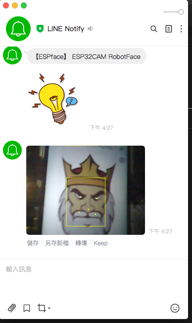

# ESP32CAM-FaceDetect-Line-Notify  

### Line-Notification w/ landmark box when ESP32Cam detects faces! ###
 
  
Try some examples from ESP-face, ESPino32Cam! 
Hardware ESP32Cam from AI-Thinker/ArduCam-IOTai.  
_The detection performance are not bad with following results..._ 
  
 
 
   
   
 
 
  

## References
  - [ESP32CAM](https://github.com/espressif/esp32-camera)  Arduino library for ESP32 camera.
  - [ESP-face](https://github.com/espressif/esp-face)  Espressif esp32cam face detection.
  - [ESPino32Cam examples](https://github.com/ThaiEasyElec/ESPino32/tree/master/examples/camera)  Another ESP32cam examples.
